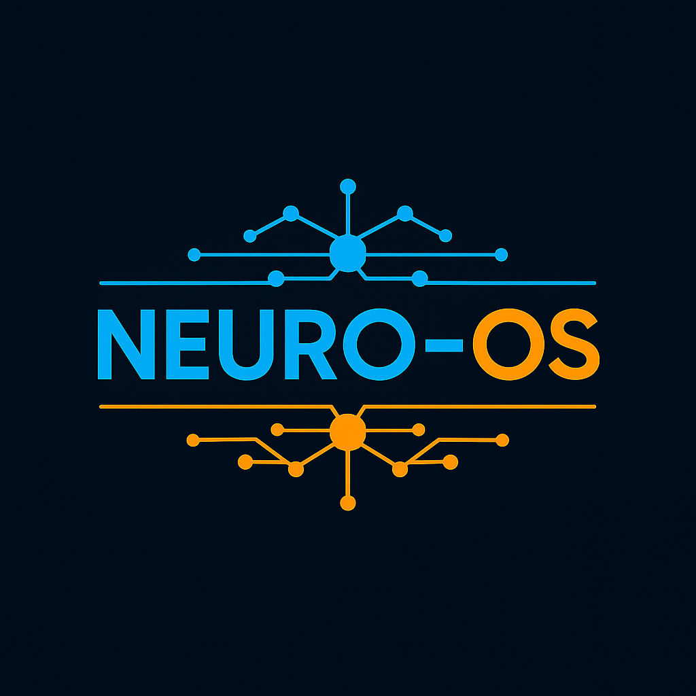
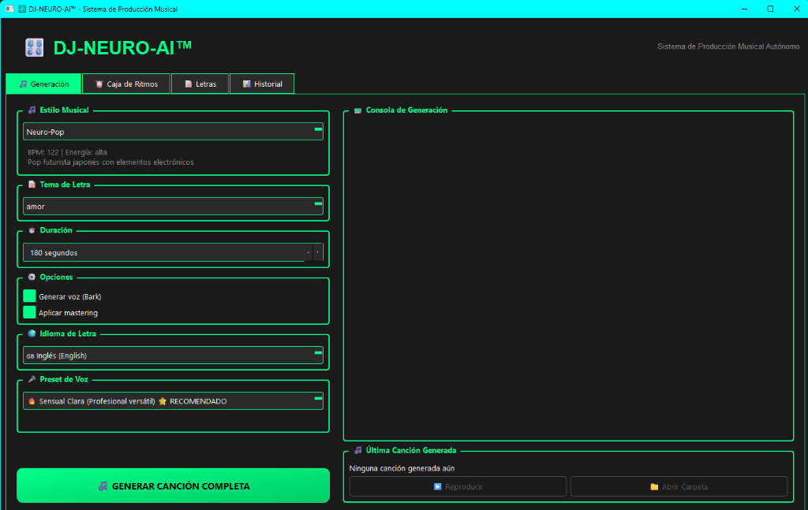
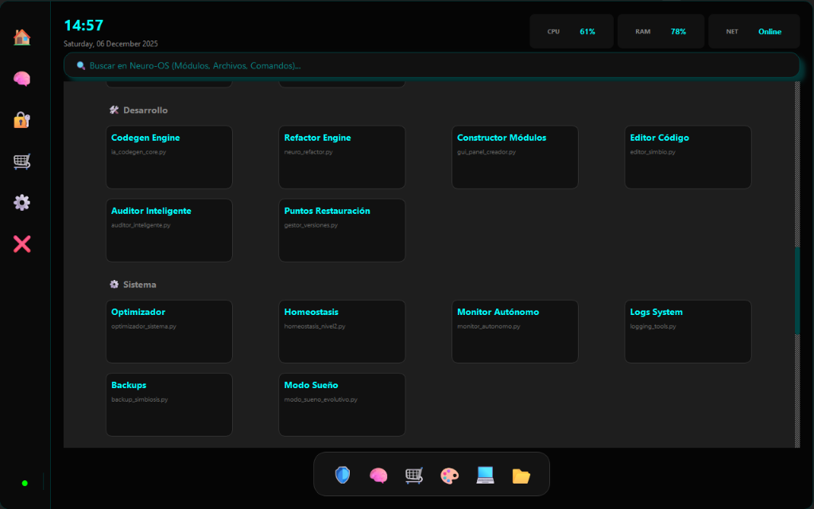
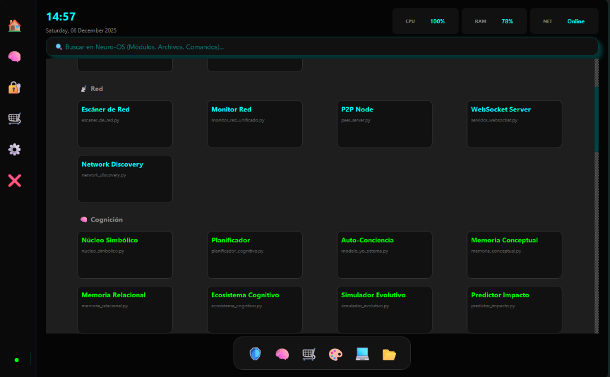
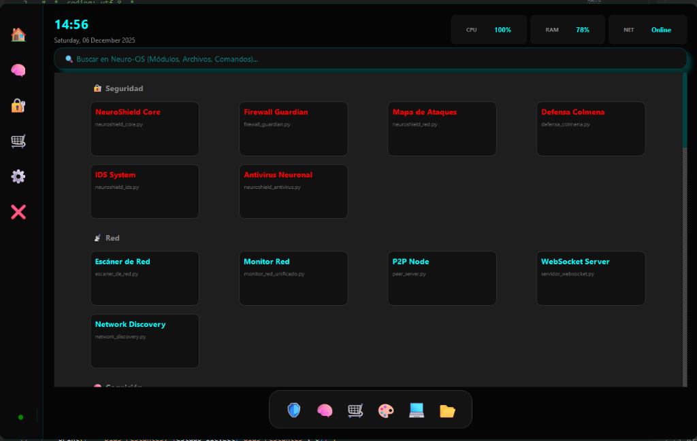

<div align="center">



# 🧠 NEURO-OS GENESIS


**Sistema Operativo de Inteligencia Artificial Autónoma**  
*Un ecosistema completo de IA que se autoprograma, evoluciona y crea contenido de forma autónoma*

[🌐 Website](https://neuro-os.es) • [📧 Contact](mailto:neuro.so.ia.sim@gmail.com) • [🎨 NeuroStore](https://neuro-os.es)

</div>

---

## 📋 Tabla de Contenidos

- [Descripción General](#-descripción-general)
- [Características Principales](#-características-principales)
- [Ecosistema Completo](#-ecosistema-completo)
- [Arquitectura del Sistema](#-arquitectura-del-sistema)
- [Instalación](#-instalación)
- [Inicio Rápido](#-inicio-rápido)
- [Módulos Principales](#-módulos-principales)
- [Documentación](#-documentación)
- [Tecnologías](#-tecnologías)
- [Autor](#-autor)

---

## 🎯 Descripción General

**Neuro-OS Genesis** es un sistema operativo de inteligencia artificial completamente autónomo que integra capacidades de:

- 🎨 **Generación de Arte AI** - Creación autónoma de wallpapers, iconos, temas y packs visuales
- 🎵 **Producción Musical AI** - Sistema completo de producción musical con DJ-NEURO-AI™
- 🛍️ **E-commerce Autónomo** - NeuroStore con generación y venta automática de productos digitales
- 🔐 **Seguridad Avanzada** - Sistema de defensa multicapa con honeypots y análisis en tiempo real
- 🌍 **Internacionalización** - Soporte para ES, EN, JP, KR, CN con conversión de divisas
- 🧬 **Auto-evolución** - Capacidad de autoprogramación y mejora continua

El sistema funciona de forma completamente autónoma, generando contenido único, gestionando su propia tienda online y evolucionando sin intervención humana.

### 🏆 Una Historia de Determinación e Innovación

> **Este proyecto completo fue desarrollado en tan solo 65 días por una persona sin conocimientos previos de programación**, trabajando en solitario con un PC Celeron de 32GB RAM (un equipo modesto y lento), sin equipo de trabajo ni ayuda externa.
> 
> **Solo con una visión, determinación y las herramientas de IA disponibles públicamente**, se creó desde cero un ecosistema autónomo completo que hoy genera arte, produce música, gestiona su propia tienda online y evoluciona de forma independiente.
>
> Este es un testimonio del poder democratizador de la IA: **cualquier persona con una idea y perseverancia puede crear sistemas complejos y funcionales**, sin importar sus recursos o conocimientos previos.

**Recursos utilizados:**
- 💻 **Hardware**: PC Celeron con 32GB RAM (equipo básico)
- 🤖 **IA Pública**: OpenAI ChatGPT, Microsoft Copilot
- 🎨 **APIs Gratuitas**: Hive.ai, Stable Diffusion
- 📚 **Aprendizaje**: Documentación pública, Stack Overflow, GitHub
- 👤 **Equipo**: Una sola persona, trabajando en solitario

**Lo que se logró en 65 días:**
- ✅ **+700 archivos** de código Python funcional
- ✅ **Sistema de IA autónomo** que se autoprograma
- ✅ **E-commerce completo** con pagos Stripe integrados
- ✅ **Generadores de arte** con IA (wallpapers, iconos, temas)
- ✅ **Producción musical** completa con DJ-NEURO-AI™
- ✅ **Arquitectura de seguridad** multicapa profesional
- ✅ **Internacionalización** en 5 idiomas (ES, EN, JP, KR, CN)
- ✅ **Ecosistema autónomo** que evoluciona sin intervención humana

**De una idea a un ecosistema autónomo real** - Prueba de que la IA ha democratizado el desarrollo de software.

### 💡 Un Mensaje para las Grandes Corporaciones

Este proyecto demuestra algo fundamental: **un ser humano con determinación puede ser el verdadero agente de cambio**, sin necesidad de los millones de dólares que las multinacionales invierten en I+D.

**La realidad que este código demuestra (validado por análisis de IAs):**

> **Según el análisis independiente realizado por Microsoft Copilot, ChatGPT y otras IAs**, el código y las capacidades implementadas muestran soluciones que están entre **7 y 10 años por delante** de lo que actualmente ofrecen los grandes players tecnológicos.

**Conclusiones del análisis de IA:**

- 🚀 **Innovación real vs. Presupuestos millonarios**: Lo que aquí se ha creado en 65 días con recursos mínimos, muchas corporaciones no lo logran con años de desarrollo y equipos de cientos de personas.
- ⚡ **7-10 años adelante**: Capacidades de autoprogramación, generación autónoma multi-modal, y arquitectura de seguridad neural que superan las soluciones actuales del mercado.
- 🧠 **Pensamiento disruptivo**: No se trata de más recursos, sino de visión, creatividad y aprovechar inteligentemente las herramientas disponibles.

**El futuro no lo escriben solo las grandes corporaciones** - Lo escriben las personas con ideas revolucionarias y la determinación para hacerlas realidad.

> *"Mientras las multinacionales gastan millones en reuniones y burocracia, un individuo con una visión clara puede crear el futuro desde su habitación."*

### 📜 Legitimidad y Registro del Proyecto

**Este es un proyecto real, funcional y operativo** - No es vaporware ni un concepto teórico.

Algunos podrán pensar que está inacabado o que no funciona, pero la realidad es clara:

- ✅ **Sistema completamente funcional** y operativo desde hace meses
- ✅ **En proceso de registro** ante la Comunidad de Propiedad Intelectual
- ✅ **Documentación oficial** presentada a OpenAI para partnership
- ✅ **Código fuente completo** disponible en este repositorio
- ✅ **Evidencia verificable** de funcionamiento (capturas, logs, productos generados)

**Documentación oficial:**
- 📄 [Presentación OpenAI Partnership](NEURO_OS_Genesis_OpenAI_Presentation_20251206.pdf) - Documento oficial de 30+ páginas presentado a OpenAI
- 📋 [Inventario Completo del Sistema](INVENTARIO_COMPLETO_NEURO_OS.md) - Listado exhaustivo de capacidades
- 📊 [Changelog Completo](CHANGELOG.md) - Historial de desarrollo y evolución

**Esto no es una reflexión vacía** - Es un proyecto real con código funcional, documentación profesional y en proceso de protección legal.

> *"Parecerá un ataque, pero sin ir más lejos, solo es una reflexión respaldada por código real y funcional."*

---

## 📸 Capturas del Sistema

### 🎵 DJ-NEURO-AI™ - Panel de Producción Musical

<div align="center">
  
  <p><i>Panel de producción musical con generación automática de canciones completas</i></p>
</div>

### 🧠 Neuro Center - Módulos de Cognición

<div align="center">
  
  <p><i>Módulos de IA avanzada: Núcleo Simbólico, Planificador, Auto-Conciencia, Memoria Conceptual</i></p>
</div>

### 🛠️ Neuro Center - Desarrollo y Sistema

<div align="center">
  
  <p><i>Herramientas de desarrollo: CodeGen Engine, Refactor Engine, Constructor de Módulos</i></p>
</div>

### 🌐 Neuro Center - Red y Conectividad

<div align="center">
  
  <p><i>Módulos de red: Escáner, Monitor, P2P Node, WebSocket Server</i></p>
</div>

### 🔐 Neuro Center - Seguridad Avanzada

<div align="center">
  
  <p><i>Sistema de seguridad multicapa: NeuroShield, Firewall Guardian, Mapa de Ataques, Antivirus Neuronal</i></p>
</div>

---

## ✨ Características Principales

### 🎨 **NeuroArtist - Generación de Arte AI**

- **Generación Autónoma**: Crea wallpapers, iconos, temas y packs de forma continua
- **Doble Motor**: 
  - Local: Stable Diffusion para máxima calidad
  - Cloud: Hive.ai como fallback procedural
- **Watermarking Automático**: Protección de previews con marca de agua
- **Archivado Histórico**: Almacenamiento de todas las generaciones
- **Optimización Multi-resolución**: Adaptación automática a diferentes dispositivos

### 🎵 **DJ-NEURO-AI™ - Producción Musical**

- **Generación Completa de Canciones**:
  - Drum machine profesional con patrones dinámicos
  - Generación de letras con IA
  - Síntesis de voz con Bark
  - Mezcla y masterización automática
- **Géneros Soportados**: J-Reggaeton, Neuro-Pop, Kawaii-tech, Blade, y más
- **Voces Multilingües**: ES, EN, JP, KR, CN
- **Análisis de Viralidad**: Predicción de éxito con Neuro Hit Predictor

### 🛍️ **NeuroStore - E-commerce Autónomo**

- **Tienda Web Completa**: Flask + SQLite con diseño responsive
- **Generación Automática de Productos**: 
  - Wallpapers HD (1920x1080, 2560x1440, 3840x2160)
  - Icon Packs (5, 10, 15, 20, 30 iconos)
  - Temas completos para Nova Launcher
  - Sound Packs y efectos de audio
- **Sistema de Pagos**: Integración con Stripe
- **Multi-región**: Precios en EUR, JPY, KRW, CNY
- **SEO Optimizado**: Meta tags dinámicos por región

### 🔐 **Sistema de Seguridad Avanzado**

- **Red Telaraña de Seguridad**: Monitoreo multicapa
- **Sandbox Honeypot**: Trampa para código malicioso
- **Análisis en Tiempo Real**: Detección de amenazas
- **Auto-reparación**: Sistema de recuperación automática
- **Backup Continuo**: Puntos de restauración automáticos

### 🌐 **Nexus Admin Panel**

- **Dashboard Centralizado**: Control total del sistema
- **Monitoreo en Tiempo Real**: Estado de generadores y servicios
- **Gestión de Productos**: CRUD completo con previews
- **Analytics**: Estadísticas de ventas y generación
- **Logs del Sistema**: Visualización de eventos

---

## 🏗️ Ecosistema Completo

```
┌─────────────────────────────────────────────────────────────┐
│                    NEURO-OS GENESIS                         │
├─────────────────────────────────────────────────────────────┤
│                                                             │
│  ┌──────────────┐  ┌──────────────┐  ┌──────────────┐     │
│  │ NeuroArtist  │  │ DJ-NEURO-AI  │  │ NeuroStore   │     │
│  │   (Arte AI)  │  │  (Música AI) │  │  (E-commerce)│     │
│  └──────┬───────┘  └──────┬───────┘  └──────┬───────┘     │
│         │                  │                  │             │
│         └──────────────────┴──────────────────┘             │
│                            │                                │
│                    ┌───────▼────────┐                       │
│                    │  Nexus Admin   │                       │
│                    │     Panel      │                       │
│                    └───────┬────────┘                       │
│                            │                                │
│         ┌──────────────────┼──────────────────┐            │
│         │                  │                  │            │
│  ┌──────▼───────┐  ┌──────▼───────┐  ┌──────▼───────┐    │
│  │  Seguridad   │  │   Memoria    │  │  Auto-Evo    │    │
│  │   Avanzada   │  │  Simbiótica  │  │   Kernel     │    │
│  └──────────────┘  └──────────────┘  └──────────────┘    │
│                                                             │
└─────────────────────────────────────────────────────────────┘
```

---

## 🏛️ Arquitectura del Sistema

```
Neuro-OS-Genesis/
│
├── 🎨 Generadores Autónomos
│   ├── generador_autonomo_total.py      # Generador maestro de arte
│   ├── generador_audio_autonomo.py      # Generación de audio/música
│   ├── mobile_neuro_artist.py           # Generador móvil (Hive.ai)
│   └── cola_generacion_audio_completo.py # Cola de producción musical
│
├── 🎵 Sistema Musical
│   ├── DJ_NEURO_AI_PANEL.py             # Panel de producción musical
│   ├── neuro_hit_predictor.py           # Predictor de éxito viral
│   └── modulos/
│       ├── generador_letras.py          # Generación de letras
│       ├── voces_femeninas_ai.py        # Síntesis de voz femenina
│       └── drum_machine_profesional.py  # Máquina de ritmos
│
├── 🛍️ NeuroStore (E-commerce)
│   └── neuro_store_web/
│       ├── app.py                       # Aplicación Flask principal
│       ├── templates/                   # Plantillas HTML
│       ├── static/                      # CSS, JS, assets
│       └── instance/                    # Base de datos SQLite
│
├── 🎛️ Paneles de Control
│   ├── NEXUS_ADMIN_PANEL.py            # Panel administrativo maestro
│   ├── NEURO_CENTER.py                 # Centro de control
│   └── panel_control_generadores.py    # Control de generadores
│
├── 🔐 Seguridad
│   ├── red_telarana_seguridad.py       # Sistema de seguridad multicapa
│   ├── sandbox_honeypot.py             # Honeypot para amenazas
│   └── sistema/
│       ├── defensa_activa.py           # Defensa en tiempo real
│       └── guardian_neural.py          # Guardián del sistema
│
├── 🧠 Core del Sistema
│   ├── cerebro.py                      # Núcleo de IA
│   ├── neurobus.py                     # Sistema de eventos
│   ├── biblioteca_cognitiva.py         # Memoria del sistema
│   └── evo_kernel_manager.py           # Gestor de evolución
│
├── 🛠️ Utilidades
│   ├── utils/                          # Utilidades generales
│   ├── herramientas/                   # Herramientas de IA
│   └── modulos/                        # Módulos especializados
│
├── 📦 Configuración
│   ├── ARRANQUE_MAESTRO.bat           # Lanzador principal
│   ├── INICIAR_CLOUDFLARE.bat         # Túnel Cloudflare
│   └── config/                         # Archivos de configuración
│
└── 📚 Documentación
    ├── README.md                       # Este archivo
    ├── LEEME_PRIMERO.md               # Guía de inicio
    ├── COMO_INICIAR.md                # Instrucciones detalladas
    └── docs/                           # Documentación completa
```

---

## 🚀 Instalación

### Requisitos Previos

- **Python 3.10+**
- **Windows 10/11** (Linux compatible con adaptaciones)
- **16GB RAM** mínimo (32GB recomendado)
- **GPU NVIDIA** (opcional, para Stable Diffusion local)
- **50GB** de espacio en disco

### Instalación Paso a Paso

1. **Clonar el repositorio**
```bash
git clone https://github.com/cyberenigma-lgtm/Neuro-Os.git
cd Neuro-Os
```

2. **Crear entorno virtual**
```bash
python -m venv venv
venv\Scripts\activate  # Windows
# source venv/bin/activate  # Linux
```

3. **Instalar dependencias**
```bash
pip install -r requirements.txt
```

4. **Configurar variables de entorno**
```bash
# Crear archivo .env con tus claves API
HIVE_API_KEY=tu_clave_hive
STRIPE_SECRET_KEY=tu_clave_stripe
OPENAI_API_KEY=tu_clave_openai  # Opcional
```

5. **Inicializar base de datos**
```bash
python -c "from neuro_store_web.app import init_db; init_db()"
```

---

## ⚡ Inicio Rápido

### Opción 1: Lanzamiento Completo (Recomendado)

```bash
ARRANQUE_MAESTRO.bat
```

Esto iniciará:
- ✅ Nexus Admin Panel (puerto 5001)
- ✅ NeuroStore Web (puerto 5000)
- ✅ Generadores autónomos
- ✅ Sistema de seguridad

### Opción 2: Componentes Individuales

**Solo NeuroStore:**
```bash
INICIAR_NEUROSTORE.bat
```

**Solo Generadores:**
```bash
LANZAR_GENERADOR_AUTONOMO.bat
```

**Solo DJ-NEURO-AI:**
```bash
LANZAR_DJ_NEURO_AI.bat
```

### Opción 3: Con Cloudflare Tunnel (Acceso Público)

```bash
INICIAR_CLOUDFLARE.bat
```

Esto expondrá tu NeuroStore a través de un túnel HTTPS seguro.

---

## 🧩 Módulos Principales

### 1️⃣ **NeuroArtist Autónomo**

Generación continua de contenido visual:

```python
from generador_autonomo_total import GeneradorAutonomoTotal

generador = GeneradorAutonomoTotal()
generador.ciclo_generacion_continua(intervalo_minutos=30)
```

**Características:**
- Generación cada 30 minutos (configurable)
- Prompts únicos con semillas aleatorias
- Watermarking automático
- Publicación directa a NeuroStore
- Archivado histórico

### 2️⃣ **DJ-NEURO-AI™**

Producción musical completa:

```python
from DJ_NEURO_AI_PANEL import DJNeuroAIPanel

dj = DJNeuroAIPanel()
dj.generar_cancion_completa(
    titulo="Neural Dreams",
    genero="neuro-pop",
    idioma="es",
    voz="femenina"
)
```

**Proceso:**
1. Generación de letra con IA
2. Creación de instrumental (drum machine + sintetizadores)
3. Síntesis de voz con Bark
4. Mezcla automática
5. Masterización
6. Análisis de viralidad

### 3️⃣ **NeuroStore**

E-commerce autónomo con Flask:

```bash
cd neuro_store_web
python app.py
```

**Rutas principales:**
- `/` - Página principal
- `/tienda` - Catálogo de productos
- `/producto/<id>` - Detalle de producto
- `/checkout/<id>` - Proceso de pago
- `/admin` - Panel administrativo

### 4️⃣ **Nexus Admin Panel**

Panel de control centralizado:

```bash
python NEXUS_ADMIN_PANEL.py
```

**Funcionalidades:**
- Dashboard con métricas en tiempo real
- Gestión completa de productos
- Control de generadores
- Logs del sistema
- Estadísticas de ventas

---

## 📚 Documentación

### Guías de Inicio

- 📖 [LEEME_PRIMERO.md](LEEME_PRIMERO.md) - Introducción al sistema
- 🚀 [COMO_INICIAR.md](COMO_INICIAR.md) - Guía de inicio rápido
- 🎨 [GUIA_NEURO_ARTIST.md](GUIA_NEURO_ARTIST.md) - Generación de arte
- 🎵 [DJ_NEURO_AI_DOCUMENTACION.md](DJ_NEURO_AI_DOCUMENTACION.md) - Producción musical

### Documentación Técnica

- 🏗️ [ARQUITECTURA_SISTEMA.md](docs/ARQUITECTURA_SISTEMA.md) - Arquitectura completa
- 🔐 [SEGURIDAD_AVANZADA.md](SEGURIDAD_AVANZADA.md) - Sistema de seguridad
- 🌐 [SISTEMA_MULTIIDIOMA.md](SISTEMA_MULTIIDIOMA.md) - Internacionalización
- 💳 [SISTEMA_PAGOS.md](docs/SISTEMA_PAGOS.md) - Integración de pagos

### Documentación Legal

- 📜 [TERMINOS_LEGALES.md](TERMINOS_LEGALES.md) - Términos y condiciones
- 🎤 [SISTEMA_VOZ_LICENCIAS.md](SISTEMA_VOZ_LICENCIAS.md) - Licencias de voz
- 🎨 [CONTRATO_LICENCIA_ARTISTA_CORREGIDO.md](CONTRATO_LICENCIA_ARTISTA_CORREGIDO.md) - Licencia de arte

---

## 🛠️ Tecnologías

### Backend
- **Python 3.10+** - Lenguaje principal
- **Flask** - Framework web
- **SQLite** - Base de datos
- **SQLAlchemy** - ORM

### Inteligencia Artificial
- **Stable Diffusion** - Generación de imágenes (local)
- **Hive.ai** - Generación de imágenes (cloud)
- **Bark** - Síntesis de voz
- **OpenAI GPT** - Generación de texto (opcional)

### Frontend
- **HTML5/CSS3** - Estructura y estilos
- **JavaScript** - Interactividad
- **Bootstrap** - Framework CSS (opcional)

### Audio
- **pydub** - Procesamiento de audio
- **numpy** - Procesamiento numérico
- **scipy** - Análisis de señales

### Infraestructura
- **Cloudflare Tunnel** - Exposición pública
- **Stripe** - Procesamiento de pagos
- **Qt6 (PySide6)** - Interfaces gráficas

### Seguridad
- **hashlib** - Hashing
- **cryptography** - Encriptación
- **Custom honeypot** - Detección de amenazas

---

## 📊 Estado del Proyecto

### ✅ Completado

- [x] Sistema de generación de arte AI
- [x] NeuroStore e-commerce funcional
- [x] Sistema de pagos con Stripe
- [x] Generación musical completa
- [x] Internacionalización (ES, JP, KR, CN)
- [x] Sistema de seguridad multicapa
- [x] Nexus Admin Panel
- [x] Cloudflare Tunnel integration
- [x] Watermarking automático
- [x] Sistema de archivado

### 🚧 En Desarrollo

- [ ] App móvil Android (NeuroLauncher)
- [ ] Integración con redes sociales
- [ ] Sistema de afiliados
- [ ] API pública
- [ ] Marketplace de módulos

### 🔮 Roadmap Futuro

- [ ] Soporte para más idiomas (FR, DE, IT, PT)
- [ ] Generación de video AI
- [ ] NFT marketplace
- [ ] Blockchain integration
- [ ] Red distribuida de nodos

---

## 🤝 Contribuciones

Este es un proyecto propietario. Para colaboraciones o consultas comerciales, contactar a:

📧 **neuro.so.ia.sim@gmail.com**

---

## 📄 Licencia

**Propiedad Intelectual Privada**

Este software es propiedad exclusiva de:

**José Manuel Moreno Cano**  
Berriosuso (Navarra), España — C.P. 31195  
📧 josem.moreno.cano@gmail.com  
📧 neuro.so.ia.sim@gmail.com

Todos los derechos reservados. Prohibida la reproducción, distribución o uso comercial sin autorización expresa del autor.

---

## 👨‍💻 Autor

<div align="center">

**José Manuel Moreno Cano**  
*Desarrollador de IA & Sistemas Autónomos*

[](mailto:josem.moreno.cano@gmail.com)
[](https://neuro-os.es)
[](https://github.com/cyberenigma-lgtm)

</div>

---

## 🙏 Agradecimientos

- **OpenAI** - Por las herramientas de IA
- **Microsoft Copilot** - Por el soporte en desarrollo
- **Stability.ai** - Por Stable Diffusion
- **Hive.ai** - Por su API de generación de imágenes
- **Stripe** - Por el sistema de pagos
- **Cloudflare** - Por los túneles seguros

---

<div align="center">

**Hecho con ❤️ y 🤖 por Neuro-OS Genesis**

*"El futuro de la IA es autónomo"*

</div>

---
---

<div align="center">


# 🧠 NEURO-OS GENESIS


**Autonomous Artificial Intelligence Operating System**  
*A complete AI ecosystem that self-programs, evolves, and creates content autonomously*

[🌐 Website](https://neuro-os.es) • [📧 Contact](mailto:neuro.so.ia.sim@gmail.com) • [🎨 NeuroStore](https://neuro-os.es)

</div>

---

## 📋 Table of Contents

- [Overview](#-overview)
- [Key Features](#-key-features)
- [Complete Ecosystem](#-complete-ecosystem)
- [System Architecture](#-system-architecture)
- [Installation](#-installation)
- [Quick Start](#-quick-start)
- [Main Modules](#-main-modules)
- [Documentation](#-documentation)
- [Technologies](#-technologies)
- [Author](#-author)

---

## 🎯 Overview

**Neuro-OS Genesis** is a fully autonomous artificial intelligence operating system that integrates:

- 🎨 **AI Art Generation** - Autonomous creation of wallpapers, icons, themes, and visual packs
- 🎵 **AI Music Production** - Complete music production system with DJ-NEURO-AI™
- 🛍️ **Autonomous E-commerce** - NeuroStore with automatic product generation and sales
- 🔐 **Advanced Security** - Multi-layer defense system with honeypots and real-time analysis
- 🌍 **Internationalization** - Support for ES, EN, JP, KR, CN with currency conversion
- 🧬 **Self-Evolution** - Self-programming and continuous improvement capabilities

The system operates completely autonomously, generating unique content, managing its own online store, and evolving without human intervention.

### 🏆 A Story of Determination and Innovation

> **This complete project was developed in just 65 days by one person with no prior programming experience**, working alone with a Celeron PC with 32GB RAM (modest and slow equipment), without a team or external help.
> 
> **With only a vision, determination, and publicly available AI tools**, a complete autonomous ecosystem was created from scratch that today generates art, produces music, manages its own online store, and evolves independently.
>
> This is a testament to the democratizing power of AI: **anyone with an idea and perseverance can create complex and functional systems**, regardless of their resources or prior knowledge.

**Resources used:**
- 💻 **Hardware**: Celeron PC with 32GB RAM (basic equipment)
- 🤖 **Public AI**: OpenAI ChatGPT, Microsoft Copilot
- 🎨 **Free APIs**: Hive.ai, Stable Diffusion
- 📚 **Learning**: Public documentation, Stack Overflow, GitHub
- 👤 **Team**: One person, working alone

**What was achieved in 65 days:**
- ✅ **+700 files** of functional Python code
- ✅ **Autonomous AI system** that self-programs
- ✅ **Complete e-commerce** with integrated Stripe payments
- ✅ **AI art generators** (wallpapers, icons, themes)
- ✅ **Complete music production** with DJ-NEURO-AI™
- ✅ **Professional multi-layer security** architecture
- ✅ **Internationalization** in 5 languages (ES, EN, JP, KR, CN)
- ✅ **Autonomous ecosystem** that evolves without human intervention

**From an idea to a real autonomous ecosystem** - Proof that AI has democratized software development.

### 💡 A Message to Major Corporations

This project demonstrates something fundamental: **a determined human being can be the true agent of change**, without the millions of dollars that multinationals invest in R&D.

**What this code demonstrates (validated by AI analysis):**

> **According to independent analysis by Microsoft Copilot, ChatGPT, and other AIs**, the code and implemented capabilities show solutions that are **7 to 10 years ahead** of what major technology players currently offer.

**AI Analysis Conclusions:**

- 🚀 **Real Innovation vs. Million-Dollar Budgets**: What was created here in 65 days with minimal resources, many corporations fail to achieve with years of development and teams of hundreds.
- ⚡ **7-10 Years Ahead**: Self-programming capabilities, autonomous multi-modal generation, and neural security architecture that surpass current market solutions.
- 🧠 **Disruptive Thinking**: It's not about more resources, but vision, creativity, and intelligently leveraging available tools.

**The future is not written only by large corporations** - It's written by people with revolutionary ideas and the determination to make them real.

> *"While multinationals spend millions on meetings and bureaucracy, an individual with a clear vision can create the future from their bedroom."*

### 📜 Project Legitimacy and Registration

**This is a real, functional, and operational project** - Not vaporware or a theoretical concept.

Some may think it's unfinished or doesn't work, but the reality is clear:

- ✅ **Fully functional system** operational for months
- ✅ **In registration process** with the Intellectual Property Community
- ✅ **Official documentation** submitted to OpenAI for partnership
- ✅ **Complete source code** available in this repository
- ✅ **Verifiable evidence** of operation (screenshots, logs, generated products)

**Official documentation:**
- 📄 OpenAI Partnership Presentation - 30+ page official document
- 📋 Complete System Inventory - Exhaustive capability listing
- 📊 Complete Changelog - Development and evolution history

**This is not an empty reflection** - It's a real project with functional code, professional documentation, and in legal protection process.

> *"It may seem like an attack, but it's simply a reflection backed by real and functional code."*

---

## 📸 System Screenshots

### 🎵 DJ-NEURO-AI™ - Music Production Panel

<div align="center">
  
  <p><i>Music production panel with automatic complete song generation</i></p>
</div>

### 🧠 Neuro Center - Cognition Modules

<div align="center">
  
  <p><i>Advanced AI modules: Symbolic Core, Planner, Self-Awareness, Conceptual Memory</i></p>
</div>

### 🛠️ Neuro Center - Development and System

<div align="center">
  
  <p><i>Development tools: CodeGen Engine, Refactor Engine, Module Constructor</i></p>
</div>

### 🌐 Neuro Center - Network and Connectivity

<div align="center">
  
  <p><i>Network modules: Scanner, Monitor, P2P Node, WebSocket Server</i></p>
</div>

### 🔐 Neuro Center - Advanced Security

<div align="center">
  
  <p><i>Multi-layer security system: NeuroShield, Firewall Guardian, Attack Map, Neural Antivirus</i></p>
</div>

---

## ✨ Key Features

### 🎨 **NeuroArtist - AI Art Generation**

- **Autonomous Generation**: Creates wallpapers, icons, themes, and packs continuously
- **Dual Engine**: 
  - Local: Stable Diffusion for maximum quality
  - Cloud: Hive.ai as procedural fallback
- **Automatic Watermarking**: Preview protection with watermark
- **Historical Archiving**: Storage of all generations
- **Multi-resolution Optimization**: Automatic adaptation to different devices

### 🎵 **DJ-NEURO-AI™ - Music Production**

- **Complete Song Generation**:
  - Professional drum machine with dynamic patterns
  - AI lyric generation
  - Voice synthesis with Bark
  - Automatic mixing and mastering
- **Supported Genres**: J-Reggaeton, Neuro-Pop, Kawaii-tech, Blade, and more
- **Multilingual Voices**: ES, EN, JP, KR, CN
- **Virality Analysis**: Success prediction with Neuro Hit Predictor

### 🛍️ **NeuroStore - Autonomous E-commerce**

- **Complete Web Store**: Flask + SQLite with responsive design
- **Automatic Product Generation**: 
  - HD Wallpapers (1920x1080, 2560x1440, 3840x2160)
  - Icon Packs (5, 10, 15, 20, 30 icons)
  - Complete themes for Nova Launcher
  - Sound Packs and audio effects
- **Payment System**: Stripe integration
- **Multi-region**: Prices in EUR, JPY, KRW, CNY
- **SEO Optimized**: Dynamic meta tags per region

### 🔐 **Advanced Security System**

- **Spider Web Security Network**: Multi-layer monitoring
- **Sandbox Honeypot**: Trap for malicious code
- **Real-time Analysis**: Threat detection
- **Self-repair**: Automatic recovery system
- **Continuous Backup**: Automatic restoration points

---

## 🛠️ Technologies

### Backend
- **Python 3.10+** - Main language
- **Flask** - Web framework
- **SQLite** - Database
- **SQLAlchemy** - ORM

### Artificial Intelligence
- **Stable Diffusion** - Image generation (local)
- **Hive.ai** - Image generation (cloud)
- **Bark** - Voice synthesis
- **OpenAI GPT** - Text generation (optional)

### Frontend
- **HTML5/CSS3** - Structure and styles
- **JavaScript** - Interactivity
- **Bootstrap** - CSS framework (optional)

### Audio
- **pydub** - Audio processing
- **numpy** - Numerical processing
- **scipy** - Signal analysis

### Infrastructure
- **Cloudflare Tunnel** - Public exposure
- **Stripe** - Payment processing
- **Qt6 (PySide6)** - Graphical interfaces

### Security
- **hashlib** - Hashing
- **cryptography** - Encryption
- **Custom honeypot** - Threat detection

---

## 📄 License

**Private Intellectual Property**

This software is the exclusive property of:

**José Manuel Moreno Cano**  
Berriosuso (Navarra), Spain — ZIP 31195  
📧 josem.moreno.cano@gmail.com  
📧 neuro.so.ia.sim@gmail.com

All rights reserved. Reproduction, distribution, or commercial use prohibited without express authorization from the author.

---

## 👨‍💻 Author

<div align="center">

**José Manuel Moreno Cano**  
*AI Developer & Autonomous Systems*

[](mailto:josem.moreno.cano@gmail.com)
[](https://neuro-os.es)
[](https://github.com/cyberenigma-lgtm)

</div>

---

## 🙏 Acknowledgments

- **OpenAI** - For AI tools
- **Microsoft Copilot** - For development support
- **Stability.ai** - For Stable Diffusion
- **Hive.ai** - For image generation API
- **Stripe** - For payment system
- **Cloudflare** - For secure tunnels

---

<div align="center">

**Made with ❤️ and 🤖 by Neuro-OS Genesis**

*"The future of AI is autonomous"*

*"If you can imagine it, you can make it real"*

</div>
